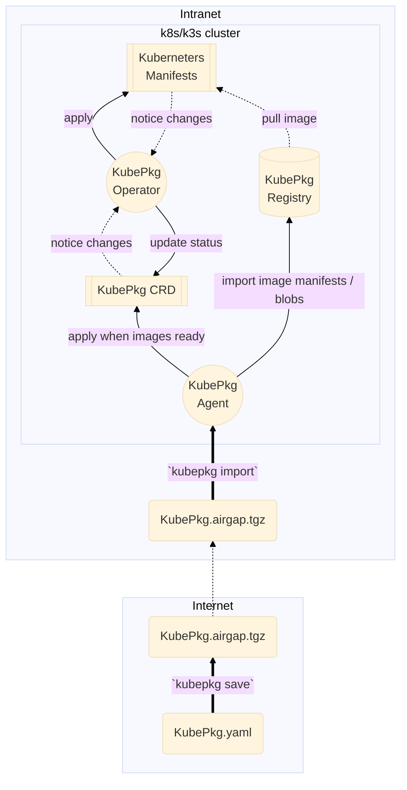

# KubePkg



## Requires

* Docker Image only support v2
* k3s/k8s 1.22+

## `kubepkg.airgap.tgz`

* `kubepkg.json`: KubePkg CRD json
* [OCI Image Layout](https://github.com/opencontainers/image-spec/blob/main/image-layout.md)

```
kubepkg.json # must be first of all
blobs/ # blob contents
  <alg>/
    <hash>
index.json # oci image layout required
oci-layout # oci image layout required    
```
