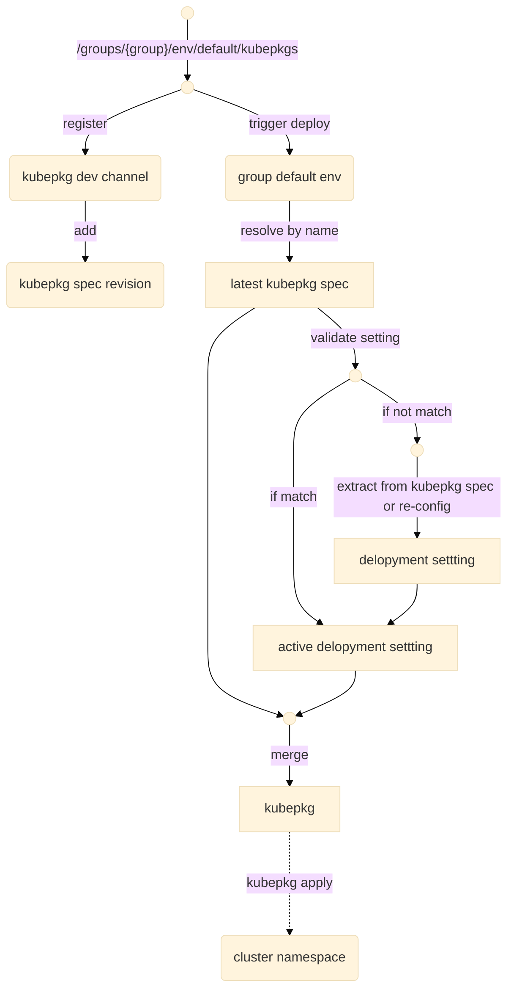
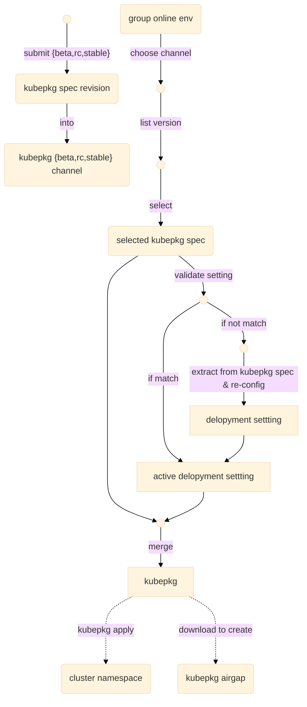

## Workflow for CI Deployment

```mermaid
%%{init:{'theme':'base'}}%%
flowchart TB
    ci(( ))
    
    ci 
    -->|"/groups/{group}/env/default/kubepkgs"| on_kubepkg(( ))
    -->|"register"| kubepkg_dev_chanel("kubepkg dev channel")
    -->|"add"| kubepkg_spec("kubepkg spec revision")
    
    default_env("group default env")  
    
    deployment_setting["delopyment settting"]
    active_deployment_setting["active delopyment settting"]
    
    latest_kubepkg_spec["latest kubepkg spec"]
    
    on_kubepkg 
    -->|"trigger deploy"| default_env
    -->|"resolve by name"| latest_kubepkg_spec
    -->|"validate setting"| validate_setting(( ))
    -->|"if match"| active_deployment_setting
    
    validate_setting 
    -->|"if not match"| create_deployment_setting(( ))
    -->|"extract from kubepkg spec or re-config"| deployment_setting
    --> active_deployment_setting
        
    latest_kubepkg_spec & active_deployment_setting
    --> merge(( ))
    --> |"merge"| kubepkg
    -..-> |"kubepkg apply"| namespace("cluster namespace")
```

## Workflow for Release Deployment

```mermaid
%%{init:{'theme':'base'}}%%
flowchart TB
   
    dev(( ))
    -->|"submit {beta,rc,stable}"| kubepkg_spec("kubepkg spec revision")
    -->|"into"| kubepkg_channel("kubepkg {beta,rc,stable} channel")
    
    deployment_setting["delopyment settting"]
    active_deployment_setting["active delopyment settting"]
    
    group_online_env("group online env")  
    -->|"choose channel"| check_upgrade(( ))
    -->|"list version"| select_version(( )) 
    -->|"select"| selected_kubepkg_spec("selected kubepkg spec")
    -->|"validate setting"| validate_setting(( ))
    -->|"if match"| active_deployment_setting
    
    validate_setting 
        -->|"if not match"| create_deployment_setting(( ))
        -->|"extract from kubepkg spec & re-config"| deployment_setting
        --> active_deployment_setting
        
    selected_kubepkg_spec & active_deployment_setting
    --> merge(( ))
    --> |"merge"| kubepkg
    
    kubepkg
    -..-> |"kubepkg apply"| namespace("cluster namespace")
    
    kubepkg
    -..-> |"download to create"| kubepkg_airgap("kubepkg airgap")
```